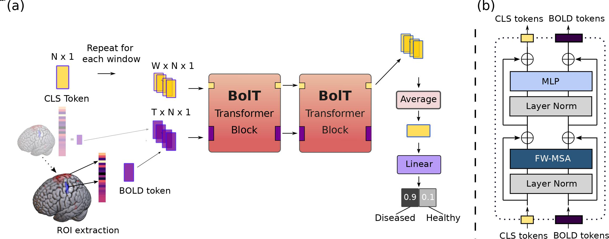
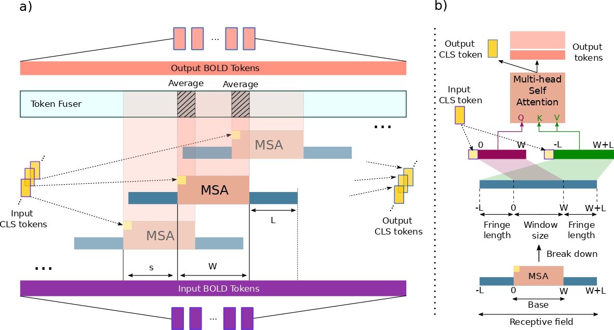

# **BolT**

## *Fused Window Transformers for fMRI Time Series Analysis*

Official PyTorch implementation of BolT described in the [paper](https://www.sciencedirect.com/science/article/pii/S1361841523001019).

## Overall View

### Architecture

### FW-MSA : Fused window multi-head self-attention

## Running

### Dependicies

* python >= 3.7
* numpy >= 1.21.4
* torch >= 1.10.1
* torch-cuda >= 10.2
* torchvision >= 0.11.2
* timm >= 0.5.4
* nilearn >= 0.8.1
* tqdm >= 4.62.3
* MRIcroGL >= 1.2
* opencv-python >= 4.5.5

### Dataset
In our work, we used two datasets, ABIDE I and the HCP dataset. We provide a testing environment for both, with a data fetcher script for ABIDE I using the famous nilearn python package. To replicate our results on the HCP dataset, you have to download the HCP dataset from the [Human Connectome Project](https://db.humanconnectome.org/).

### Data Prep

Before doing anything, you need to have ROI extracted versions of the downloaded 4D fMRI datasets. We provide the ROI extractor python script for ABIDE I and also the 4D fMRI data fetcher script. Please note that you do not have to use these scripts to reproduce the results of our paper, as long as you link ROI extracted fMRI data to [dataset.py](/Dataset/dataset.py) 

For ABIDE I: 

    python prep.py --dataset abide1

This will both download 4D fMRI data (to "Dataset/Data/Bulk/ABIDE/") and extract ROIs ready to be used by BolT.

## Train and Testing

For training and testing our model run [tester.py](tester.py) file.

    python tester.py --dataset abide1 --model bolT

## Analysis

We need the relevancy maps for each subject for any kind of analysis. To obtain them, we need to do a couple of things

First is to pass --analysis True flag to the tester code. This is required to save trained models for each fold.

    python tester.py --dataset abide1 --model bolT --analysis True

Second is to extract the relevancy map for each fold the model is trained on. For this, cd into Analysis folder and run [analysis_extractRawData.py](/Analysis/analysis_extractRawData.py)

    cd Analysis
    python analysis_extractRawData.py --dataset abide1

The required data to do the analysis should have been populated inside the analysis [Data](/Analysis/Data) folder.

### Interpretability

To generate the relevancy map plots in the paper for the HCP-Task dataset, please see [Token Painting](/Analysis/TokenPainting) folder. We also give the subtask timings for the tasks in [Task Timings](/Analysis/TaskTimings) folder.

### Target Site Visualizations for the Classification Tasks

To detect target sites important for the classification tasks, we need to train logistic regression models on each fold BolT is trained and extract the regression weights. Finally, we use the average of the odd log importance of the regression weights to pick the target sites.

To do this, cd into [Analysis](/Analysis) folder and run the brainMapper file. Please note that depending on your setup, it might take significant time (8 to 24 hours) to finish the execution. From the file, you can configure a sweep for the group index (startKs) that you want to train the regression model, and again, if you choose a wide range, the execution time will increase linearly to the range of group indexes you configured. 

    cd Analysis
    python brainMapper.py --dataset abide1

At this point inside the [DataExtracted](/Analysis/DataExtracted) folder, the selected ROI should be stored in nii.gz format that can be used for the visualization purposes. In our work we used [MRIcroGL](https://github.com/rordenlab/MRIcroGL) library for the visualizations. A script used for the visualizations can be found in [brainViz](/Analysis/brainViz.py) python script.

# Contact

For questions/bugs you can open an issue or you can directly email me (I will be more than happy to help!): atakan.bedelee@gmail.com
